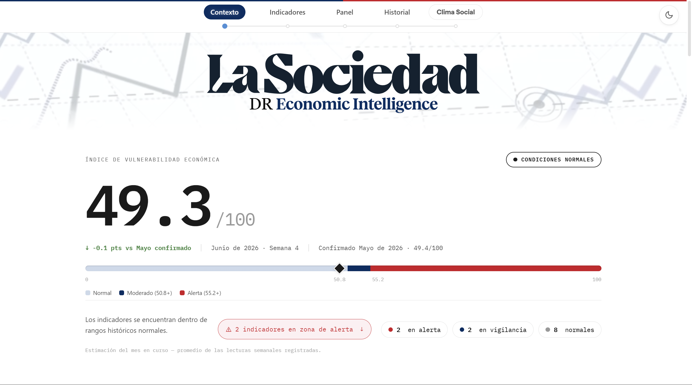

# DR Economic Intelligence

[](https://github.com/ianperaltahirujo/dr-economic-intelligence/actions/workflows/ci.yml)

Weekly economic intelligence system for the Dominican Republic, built for La Sociedad's upper management. A GitHub Actions workflow runs every Monday and publishes an updated vulnerability score, interactive dashboard, and Excel briefing to OneDrive and GitHub Pages.

**[View Live Dashboard →](https://ianperaltahirujo.github.io/dr-economic-intelligence)**

[](https://ianperaltahirujo.github.io/dr-economic-intelligence)

---

## The Vulnerability Index

The core output is a 0–100 weighted composite score measuring the DR economy's current stress level across 12 indicators. Higher scores indicate greater vulnerability. The index is designed to surface early warning signals, not to replace macroeconomic analysis, but to give non-technical leadership a single, traceable number to anchor weekly discussions.

The 12 indicators cover three dimensions of risk: external demand (remesas, tourism spend, U.S. labor and consumer conditions), domestic stability (inflation, exchange rate, international reserves, economic activity), and financial system health (banking solvency, credit quality, lending rates, fuel prices).

| Indicator | Weight | What it signals |
| --- | --- | --- |
| Tasa de cambio DOP/USD | 15% | Currency pressure — rising = stress |
| Remesas familiares (USD mm) | 10% | External demand shock — falling = stress |
| Inflación interanual (%) | 10% | Price instability — rising = stress |
| Reservas internacionales (USD mm) | 10% | External buffer erosion — falling = stress |
| Morosidad bancaria (%) | 10% | Credit quality deterioration — rising = stress |
| Desempleo EE.UU. (%) | 10% | U.S. demand risk to remesas and tourism — rising = stress |
| Gasto turístico diario (USD) | 10% | Tourism revenue health — falling = stress |
| IMAE (actividad económica) | 5% | Domestic output momentum — falling = stress |
| Solvencia bancaria (%) | 5% | Banking system resilience — falling = stress |
| Confianza del consumidor EE.UU. | 5% | Leading U.S. sentiment indicator — falling = stress |
| Tasa de interés activa (%) | 5% | Credit cost burden — rising = stress |
| Gasolina Premium (DOP/galón) | 5% | Imported inflation and cost pressure — rising = stress |

**Score bands:** < 50.8 = Normal, 50.8–55.1 = Moderate Stress, ≥ 55.2 = High Stress. Thresholds are calibrated to p70 and p90 of the real historical score distribution, not round numbers.

**Absolute level overrides:** Three indicators trigger stress classification regardless of their z-score, because their historical context can be misleading: IPC above 7%, DOP/USD above 65, and U.S. consumer sentiment below 60. This prevents a normalized z-score from masking conditions that are objectively severe.

**Current month estimate:** Alongside the confirmed historical score, the dashboard shows a projected score for the current in-progress calendar month, updated each week. It is built from partial-month readings averaged across the weeks recorded so far and displayed separately from the finalized historical series.

---

## Scoring methodology

Each indicator is converted to a z-score against its own rolling history, 60 months for IPC and DOP/USD (which need longer context to avoid overreacting to persistent trends), and 36 months for all others. Z-scores are direction-aware: rising unemployment is penalized; rising banking solvency is not. The weighted z-scores are rescaled to 0–100 and summed.

**Full coverage is required.** A score is only computed for months where all 12 indicators have valid data after fills. There is no renormalization over a partial set; a score from 10 of 12 indicators is not the same quantity as one from 12 of 12. If coverage drops below 10 of 12 in the most recent 6 months, the pipeline raises an error and does not publish.

**Forward-fills are targeted, not blanket.** Each indicator has an explicit fill limit tied to its actual publication lag:

- Remesas, IMAE, SB banking, U.S. consumer sentiment: up to 2 months, covers expected institutional delay, does not flag the score as provisional.
- Tourism daily spend: up to 6 months, because the BCRD survey typically publishes 6 months behind. Any score relying on this fill is marked *Avance Estimado*, displayed with a dashed line on the history chart and a disclosure note. The provisional label is never silently removed.

**Weight calibration.** Weights were validated using `pipeline/backtest_weights.py` against four known stress periods: COVID collapse (Mar–Sep 2020), post-COVID recovery (Jan–Jun 2021), inflation peak (Jun–Dec 2022), and U.S. rate shock (Jan–Jun 2023). Roughly ±30% weight jitter moves the headline score by about 1 point, so weight tuning is low-leverage relative to methodology correctness.

---

## What it produces

### Dashboard (`docs/index.html`)

A Spanish-language GitHub Pages site with the current score in a full-width editorial hero, a macroeconomic context section, indicator cards showing each component's current reading and trend, an active alerts panel, and an interactive history chart with zoom and pan across the last 60+ months. The page is generated fresh on every pipeline run.

A companion static page (`docs/clima-social.html`) hosts the Ola 7 / April 2026 Clima Social survey report.

### Excel workbook (`data/output/vulnerability_report.xlsx`)

Six-sheet workbook generated on every run:

| Sheet | Contents |
| --- | --- |
| Dashboard | Headline score, status, all 12 indicators with values, trend arrows, and stress classification |
| Contexto | Non-scored context indicators: tourism fiscal revenue, consolidated public debt |
| Indicators | Full detail with z-scores, weights, and stress contributions per indicator |
| Alerts | Plain-language alert strings for all flagged indicators |
| History | Last 60 months of scores and raw indicator values |
| Metadata | Run timestamp, data source freshness, methodology notes |

### Weekly and monthly reports (OneDrive)

Two delivery tracks run alongside the main workbook:

**Weekly Reports** (`Economic Intelligence/Output/Weekly Reports/`) - every run writes a new dated file (`vulnerability_report_weekly_YYYY-MM-DD.xlsx`) headlined by the current month's projected score. These accumulate and are never deleted; they form a permanent audit trail of each Monday's reading.

**Monthly Reports** (`Economic Intelligence/Output/Monthly Reports/`) - once a month has full 12/12 indicator coverage, a single finalized file (`vulnerability_report_YYYY-MM.xlsx`) is written. It is only rewritten if the month is new or its provisional status changes, for example, when the BCRD finally publishes tourism data that was previously filled. State is tracked in `data/state/monthly_reports_state.json`. The *Avance Estimado* disclosure stays intact in both Excel and on the website whenever a component is filled.

### Summary email (Outlook)

A Spanish HTML summary sent from a company email via Microsoft Graph with the Weekly Report attached, linking to the live dashboard. Recipients are configured via the `EMAIL_RECIPIENTS` secret; if unset, the step is skipped.

All delivery steps - OneDrive uploads and email - are best-effort: failures are logged but never fail the workflow. The dashboard commit and the GitHub Actions artifact always proceed regardless.

---

## Data sources

| Source | Indicators | Access |
| --- | --- | --- |
| BCRD CDN | Remesas, IMAE, exchange rate, IPC, reserves, tourism arrivals | HTTPS download, no auth |
| BCRD CDN | Gas prices context, tourism fiscal revenue, consolidated debt | HTTPS download, no auth |
| Superintendencia de Bancos API v2 | Solvency, NPL ratio, lending rates | `Ocp-Apim-Subscription-Key` header |
| FRED API | U.S. unemployment (UNRATE), consumer sentiment (UMCSENT) | API key |

**BCRD CDN vs. API.** The CDN Excel files are the reliable path for historical time series. The BCRD REST API (`ingest_bcrd_api.py`) is implemented but requires IP whitelisting, unregistered IPs receive HTTP 500. Only `HistoricoTasas` and `HistoricoIPC` return true historical series; all other `MacroVariables` endpoints are current-snapshot only.

**SB API.** The `indicadores/financieros` endpoint is hard-capped at 36 months. The `solvencia` and `tasaActiva` fields return `0.00` instead of null for the most recent unvalidated months, the pipeline treats these as missing. Intermittent 500 errors are retried with exponential backoff (2s, 4s, 8s).

**Tourism spending lag.** The BCRD tourism expenditure survey publishes approximately 6 months behind the reference period, which is why this indicator has the extended fill window and the provisional disclosure system.

---

## Architecture

**Single truth function.** All classification logic - whether a reading is stress, watch, or normal, and how much it contributes to the composite lives in `classify_indicator()` in `build_vulnerability.py`. The scoring loop, Excel sheets, dashboard cards, and alert strings all route through the same function. The score on the website and the score in the Excel are guaranteed to agree.

**Scoring functions are importable without network access.** The pure scoring functions (`classify_indicator`, `compute_zscores`, `build_alerts`) have no dependency on API keys or live endpoints. Ingestion modules are imported inside `run_vulnerability_pipeline()`, not at module level, so the scoring engine can be unit-tested in isolation.

**Context indicators stay out of the score.** Tourism fiscal revenue and consolidated public debt are shown in the dashboard's Context section but do not contribute to the vulnerability score. Their annual resolution and fill artifacts would distort z-score calculations. Gas prices and tourism daily spend were explicitly promoted into the scored set; the remaining context indicators were not.

**OneDrive delivery uses app-only Graph auth.** `pipeline/ms_graph.py` authenticates with Azure AD client-credentials (no signed-in user). The OneDrive target must be a folder genuinely owned by the company email, app-only auth cannot resolve folders merely shared with that account (Graph returns 403). Visibility to the broader team is via a manual OneDrive shortcut, not pipeline logic.

---

## Automation

`.github/workflows/weekly_pipeline.yml` runs every Monday at 13:00 UTC (9:00 AM Santo Domingo time). It downloads fresh source files, scores, writes the Excel and HTML outputs, commits the regenerated `docs/index.html` back to the repo, uploads to OneDrive, and sends the summary email. `workflow_dispatch` is available for manual runs with an optional `skip_download` input. Each run also uploads the Excel workbook as a GitHub Actions artifact retained for 90 days, independent of OneDrive delivery.

Required secrets: `FRED_API_KEY`, `SB_API_KEY`, `BCRD_API_KEY`, `AZURE_TENANT_ID`, `AZURE_CLIENT_ID`, `AZURE_CLIENT_SECRET`, `EMAIL_RECIPIENTS`.

---

## Running it

```bash
# Full run (downloads fresh BCRD files, scores, writes Excel + HTML)
python run_pipeline.py

# Skip BCRD download, use cached files in data/raw/
python run_pipeline.py --skip-download

# Score only, no Excel/HTML output
python run_pipeline.py --dry-run

# Weight backtest
python pipeline/backtest_weights.py
python pipeline/backtest_weights.py --apply  # propose updated weights, requires confirmation
```

Requires Python 3.11+ and a `.env` with `FRED_API_KEY`, `SB_API_KEY`, and `BCRD_API_KEY`. On Windows, activate the venv (`venv\Scripts\Activate.ps1`) before running. See `CLAUDE.md` for full local setup and development conventions.

---

## Repository structure

```
dr-economic-intelligence/
├── run_pipeline.py                      # Main entry point
├── requirements.txt
│
├── pipeline/
│   ├── download_bcrd_files.py           # Downloads BCRD Excel files from CDN
│   ├── download_context_files.py        # Downloads gas price and tourism context files
│   ├── ingest_bcrd.py                   # Parses BCRD Excel files into DataFrames
│   ├── ingest_bcrd_api.py               # BCRD REST API client (IP-whitelisted)
│   ├── ingest_sb.py                     # Superintendencia de Bancos API v2 client
│   ├── ingest_fred_dr.py                # FRED API client for U.S. indicators
│   ├── ingest_context.py                # Gas prices, tourism fiscal revenue, national debt
│   ├── ingest_debt.py                   # BCRD consolidated public debt (quarterly)
│   ├── build_vulnerability.py           # Scoring engine, z-scores, weights, alerts
│   ├── current_month_tracker.py         # Records weekly partial readings for the in-progress month
│   ├── backtest_weights.py              # Weight optimizer against known stress periods
│   ├── write_excel.py                   # Excel workbook writer (6 sheets)
│   ├── write_html.py                    # GitHub Pages site generator
│   ├── ms_graph.py                      # Microsoft Graph client (OneDrive upload, Outlook email)
│   ├── monthly_report_state.py          # Tracks finalized monthly report state
│   └── notify_failure.py                # Pipeline failure notification helper
│
├── docs/
│   ├── assets/                          # Static assets served with the dashboard (hero-bg.mp4, etc.)
│   ├── clima-social.html                # Static Clima Social survey page
│   ├── fonts/                           # Local font files served via @font-face
│   └── index.html                       # Auto-generated dashboard - do not edit manually
│
├── data/
│   ├── raw/                             # Downloaded source files (gitignored)
│   ├── processed/                       # Intermediate CSVs (gitignored)
│   ├── output/                          # Final Excel workbook
│   └── state/                           # Pipeline state tracking (monthly reports, current-month snapshots)
│
├── tests/                               # 98 tests, run on every push via CI
│   ├── README.md
│   ├── test_build_vulnerability.py      # Unit tests for scoring and classification logic
│   ├── test_regression_real_data.py     # Regression tests against pinned real-data scores
│   ├── test_current_month_estimate.py   # In-progress-month projection arithmetic
│   ├── test_current_month_tracker.py    # Weekly partial-reading state tracker
│   ├── test_monthly_report_state.py     # Monthly report write/rewrite gating
│   ├── test_ingest_bcrd.py              # BCRD Excel parsing
│   ├── test_ms_graph.py                 # Microsoft Graph upload/email client
│   ├── test_write_excel.py              # Excel workbook writer
│   ├── test_write_html.py               # Dashboard HTML generator
│   └── fixtures/
│       └── vulnerability_history.csv
│
└── .github/workflows/
    ├── ci.yml                           # Runs the test suite on push and pull request
    └── weekly_pipeline.yml              # Scheduled Monday pipeline run
```

---

## Author

Ian Eduardo Peralta Hirujo | B.S. Applied Data Sciences, The Pennsylvania State University

---

## License

Proprietary. Copyright (c) 2026 La Sociedad. All rights reserved. This repository is published for reference only; no license to use, copy, modify, or redistribute the software or its outputs is granted. See [LICENSE](LICENSE).

---

## Built with

Python 3.11 · pandas · numpy · openpyxl · fredapi · requests · python-dotenv · scipy · Chart.js · GitHub Actions · GitHub Pages
